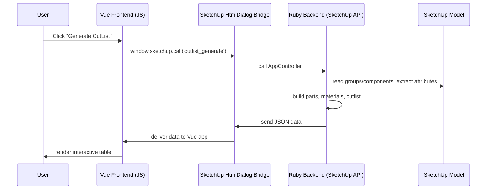

# 🧱 OpenCutList — Full Architecture Overview  
*(Prepared for LexaCut / Cursor + Claude Refactor)*

---

## 📖 Introduction

**OpenCutList** is a SketchUp Ruby Extension that generates, manages, and exports optimized cutting lists for woodworking and manufacturing projects.

It integrates tightly with the **SketchUp Ruby API**, provides a **Vue.js-based UI**, and handles data synchronization between SketchUp models and the plugin interface through an internal Ruby ↔ JS bridge.

We are forking this project into **LexaCutList**, aiming to modernize the architecture, migrate the UI to Vue 3 + Tailwind, add AI-powered optimization (CognitiveCut Engine), and enhance export/reporting capabilities.

---

## 🧩 Core Architectural Layers

### 1. SketchUp Extension Layer (Entry Point)
**Files:**
- `open_cutlist.rb`
- `src/ruby/plugin.rb`
- `src/ruby/menu.rb`

**Responsibilities:**
- Registers the extension in SketchUp using `SketchupExtension` class.
- Defines the root namespace (`OpenCutList`).
- Loads menu items under **Extensions → OpenCutList**.
- Binds menu actions to controller calls (e.g., `OpenCutList::UI.open_dialog`).

**Key Entry Sequence:**
1. SketchUp loads `open_cutlist.rb`
2. Calls `SketchupExtension.new(...)`
3. Loads `/src/ruby/plugin.rb`
4. Registers UI menus and initializes the runtime environment
5. Sets up the HTMLDialog for Vue UI

---

### 2. Data & Domain Layer
**Directory:** `/src/ruby/core/`

**Purpose:**  
Defines all models, domain objects, and logic for materials, parts, assemblies, and cutlists.

**Main Classes:**
- `Part` — represents a single 3D entity extracted from SketchUp.
- `Material` — defines type, thickness, and cost of materials.
- `CutList` — aggregates parts, computes quantities, and groups by material/type.
- `Exporter` — prepares structured data (CSV, JSON, PDF) from computed lists.

**Key Concepts:**
- Each SketchUp group/component with certain tags/layers is interpreted as a **Part**.
- Data is stored in Ruby objects (not SketchUp attributes directly).
- All data transformations happen in this layer before passing to UI.

---

### 3. Application Logic / Controllers
**Directory:** `/src/ruby/app/`

**Purpose:**  
Acts as mediator between the UI (Vue) and the core logic.

**Main Components:**
- `AppController` — main orchestrator, handles requests from JS (e.g. get_cutlist, export_data)
- `CutListManager` — builds and caches computed lists
- `ExportController` — generates CSV/PDF output
- `UIBridge` — communication gateway (uses SketchUp's `UI::HtmlDialog` bridge API)

**Workflow Example:**
1. User clicks "Generate CutList" in UI  
2. JS sends command via `window.sketchup.call('cutlist_generate')`  
3. Ruby receives → calls `CutListManager.build(model)`  
4. Result serialized to JSON → sent back to JS → rendered in Vue table

---

### 4. User Interface Layer
**Directory:** `/src/html/` and `/src/js/`

**Tech Stack:**  
Vue 2 + plain JS + Bootstrap + i18n (multi-language JSON)

**Structure:**
- `/html/dialog.html` — main entry point for SketchUp HtmlDialog
- `/js/app.js` — Vue bootstrap
- `/js/components/` — all Vue components for cutlist table, filters, settings, etc.
- `/js/i18n/` — translation JSON files for English, French, German, etc.

**Responsibilities:**
- Render cutlist table (sortable, filterable)
- Provide export options (CSV/PDF)
- Show material statistics
- Store local user preferences (using localStorage)

**Modernization Plan (LexaCutList):**
- Migrate to Vue 3 + Composition API  
- Replace Bootstrap with TailwindCSS  
- Add Dark/Light mode  
- Introduce modular UI components for:
  - Material browser
  - AI optimization results view
  - Cost analysis dashboard

---

### 5. Export & Reporting Layer
**Directory:** `/src/ruby/export/`

**Responsibilities:**
- Handle output in various formats:
  - CSV (`exporter_csv.rb`)
  - PDF (`exporter_pdf.rb`)
  - JSON (`exporter_json.rb`)
- Manage templates and formatting
- Integrate with file dialogs for saving exports
- Compute statistics like total board feet, surface area, material cost, etc.

**Future Upgrades:**
- Add **Excel Export** with styling
- Add **DXF / CNC Export** (via plugin API)
- Add **Smart Reports** (AI summary & recommendations)

---

### 6. Settings & Preferences
**Directory:** `/src/ruby/config/`

**Responsibilities:**
- Handle user preferences (units, precision, language, etc.)
- Persist configuration in SketchUp model attributes
- Provide default profiles for different industries (furniture, cabinetry, metalwork)

---

### 7. Localization System
**Directory:** `/src/locale/`

**Responsibilities:**
- Store translations (YAML or JSON)
- Provide internationalization (I18n) for both Ruby and JS layers

**LexaCut Enhancement:**
- Add Persian and Arabic support (RTL layout)
- Centralize translation in `/src/locales/`  
- Unified translation loader for Ruby + Vue

---

### 8. Assets
**Directory:** `/src/assets/`

Contains icons, SVGs, and CSS.

---

## ⚙️ Data Flow Overview (Ruby ↔ JS)



---

## 🧠 AI Integration Plan (LexaCut Enhancement)

| Module                  | Description                                                                                           | Implementation                               |
| ----------------------- | ----------------------------------------------------------------------------------------------------- | -------------------------------------------- |
| `ai_optimizer.rb`       | New Ruby module that interfaces with local or remote Python service for material layout optimization. | REST API call to `localhost:5000/optimize`   |
| `ai_recommendations.rb` | Suggest better materials, suppliers, or cut plans.                                                    | Use small LLM or rule-based logic.           |
| `ai_reporter.rb`        | Summarize project cost, waste, and improvements.                                                      | Generate Markdown/HTML report via AI output. |

---

## 🧩 Directory Tree (Simplified)

```
OpenCutList/
│
├── open_cutlist.rb               # Main entry file (loaded by SketchUp)
├── manifest.json                 # Plugin metadata
├── src/
│   ├── ruby/
│   │   ├── app/                  # Controllers, bridges
│   │   ├── core/                 # Domain models (Part, Material, CutList)
│   │   ├── export/               # Exporters
│   │   ├── config/               # Preferences & settings
│   │   └── ui/                   # UI bridges
│   ├── html/
│   │   ├── dialog.html
│   │   └── css/
│   ├── js/
│   │   ├── app.js
│   │   └── components/
│   └── locale/
│       ├── en.json
│       ├── fr.json
│       └── de.json
└── docs/
    └── ARCHITECTURE_OVERVIEW.md
```

---

## 🧩 Refactor Roadmap (Cursor / Claude Plan)

| Step | Goal                 | Description                                                  |
| ---- | -------------------- | ------------------------------------------------------------ |
| 1    | Analyze architecture | Claude reads this file and validates against codebase        |
| 2    | Namespace refactor   | Rename `OpenCutList` → `LexaCut` across all files            |
| 3    | Migrate UI           | Vue 3 + Tailwind + TypeScript setup                          |
| 4    | Introduce AI module  | Create `src/ruby/ai/` and mock Python endpoint               |
| 5    | Extend export system | Add Excel, JSON+, and PDF styling                            |
| 6    | Localization RTL     | Add Persian/Arabic i18n and UI direction detection           |
| 7    | Testing & Packaging  | Build `.rbz`, test in SketchUp 2023/2024                     |
| 8    | Documentation        | Generate `/docs/developer_guide.md` and `/docs/ai_engine.md` |

---

## 🔑 Notes for Cursor & Claude

* Always read `open_cutlist.rb` first (entry point).
* Identify every `require_relative` chain to map dependencies.
* When refactoring, preserve API signatures used by the UI.
* Use `LexaCut` namespace for all new modules.
* Store modernized UI inside `/src/frontend/` to separate from legacy code.

---

## 🧠 Memory Line (for AI)

> "A cutlist is not just geometry — it's the story of how materials transform into creation."

---

## ✅ Next Actions

1. Claude: Parse this file fully and validate with live code.
2. Generate `module_map.md` listing all Ruby modules and classes.
3. Start refactor branch: `feature/lexacut_refactor`.
4. Initialize `/src/frontend/` with modern stack.

---

*Prepared by: Parsa Barati (LexaPlus)  
For: Cursor + Claude Refactor Workflow*

